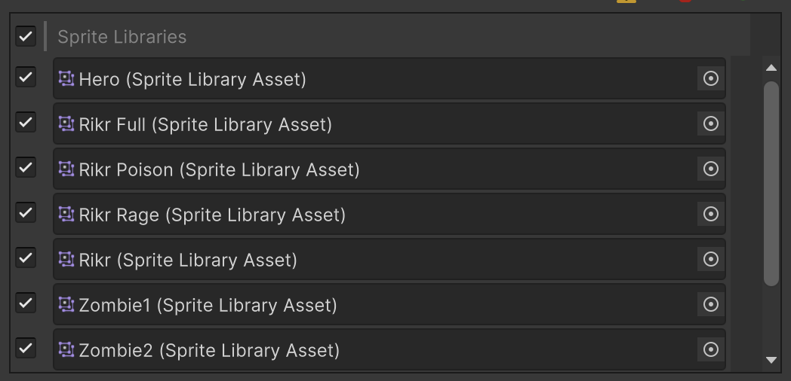
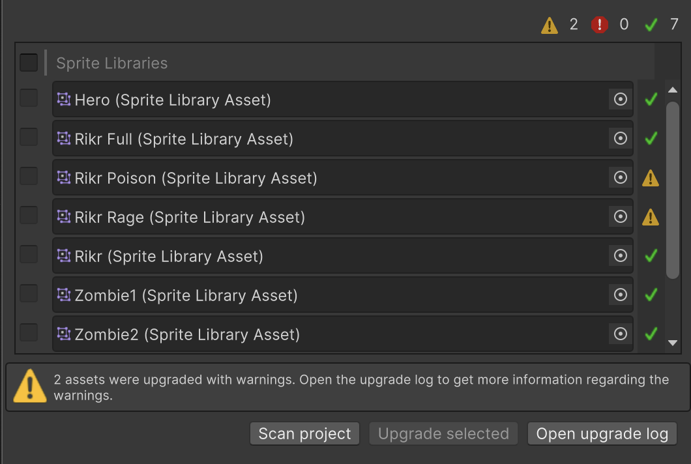
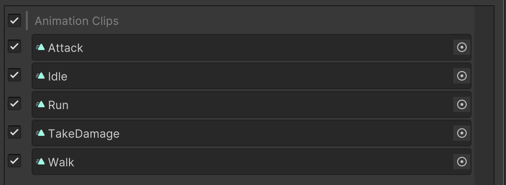
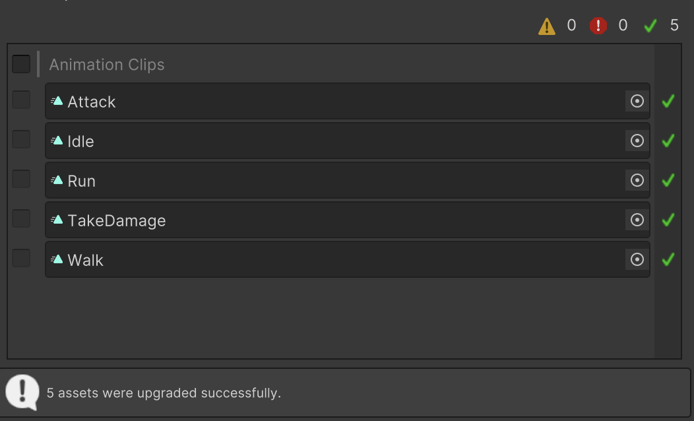
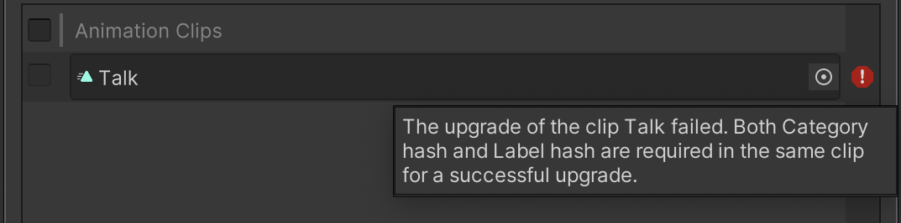
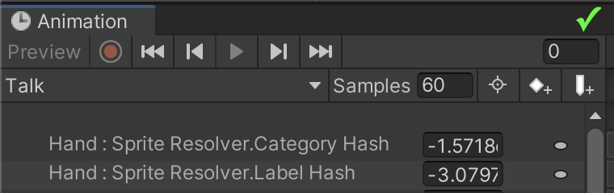
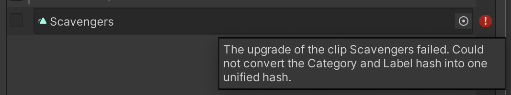

# 2D Animation Asset Upgrader

The 2D Animation package and its assets are often updated with major and minor tweaks over time. Some asset improvements can be automatically applied when you upgrade to the latest version of the package. However, some of these changes require a manual step in order to have the assets use the latest code path.

The 2D Animation Asset Upgrader tool eases the transition and upgrade of older assets to newer ones. This tool has the following features:

- Upgrades [Sprite Library Asset](SLAsset.md) files ending in `.asset` to the newer Sprite Library Asset files ending in `.spriteLib`.
- Moves Sprite Library Assets baked into `.psb` files created in Unity 2019 and Unity 2020 out into their own separate Sprite Library Asset files ending in `.spriteLib`.
- Upgrades [Animation Clips](https://docs.unity3d.com/Manual/AnimationClips.html) that animate Sprites based on the [Sprite Resolver component](https://docs.unity3d.com/Packages/com.unity.2d.animation@latest/index.html?subfolder=/manual/SLAsset.html%23sprite-resolver-component)'s [Category and Label](https://docs.unity3d.com/Packages/com.unity.2d.animation@7.0/manual/SLAsset.html#category) hash in Unity 2019 and Unity 2020, to Sprite Resolver's new **Sprite Hash** property from Unity 2022 onwards.
- Upgrades Animation Clips animating the Sprite Resolver component's **Sprite Key** property in Unity 2021, to Sprite Resolver's new Sprite Hash property from Unity 2022 onwards.

## Getting Started
Before upgrading any assets in your current project, make sure to source control or back up your project.

Go to **Window > 2D > 2D Animation Asset Upgrader** to open the 2D Animation Asset Upgrader.
 

## Upgrading Sprite Libraries
Follow these steps to upgrade the Sprite Libraries in the project.
1. [Open](#getting-started) the 2D Animation Asset Upgrader.
2. Select the __Sprite Libraries__ button to open the Sprite Libraries tab.
3. Select the __Scan project__ button. The window then displays a list of all the Sprite Libraries that you can upgrade.

5. Clear any Sprite Library Assets which you do not want to upgrade.
6. Select the __Upgrade selected__ button to begin the upgrading process.
7. The editor then displays a pop-up window to inform you that the upgrade cannot be reverted, and any [Asset Bundles](https://docs.unity3d.com/Manual/AssetBundlesIntro.html) connected to the Sprite Libraries will need to be rebuilt. Select __Yes__ to proceed with the upgrade, or __No__ to cancel the upgrading process.
8. Once the upgrading process is complete, the 2D Animation Asset Upgrader will display the status of the upgrading process for each of the selected assets.

9. Select the __Open upgrade log__ button to get more detailed information about the different upgrade warnings and errors that may appear. The upgrade log will also list all the Asset Bundles that need to be rebuilt for the upgrading process.

## Upgrade Animation Clips
Follow these steps to upgrade the Animation Clips in the project:
1. Open the 2D Animation Asset Upgrader.
2. Select the **Animation Clips** button to open the Animation Clips tab.
3. Select the __Scan project__ button. The window then displays a list of all the Animation Clips that you can upgrade.

5. Clear any Animation Clips which  you do not want to upgrade.
6. Select the __Upgrade selected__ button to begin the upgrading process.
7. The editor then displays a pop-up window to inform you that the upgrade cannot be reverted, and that any Asset Bundles connected to the Animation Clips will need to be rebuilt. Select __Yes__ to proceed with the upgrade, or __No__ to cancel the upgrading process.
8. Once the upgrading process is complete, the 2D Animation Asset Upgrader will display the status the upgrading process for each of the selected Animation Clips.

9. Select the __Open upgrade log__ button to get more detailed information about the upgrade warnings and errors that may appear. The upgrade log will also list all the Asset Bundles that need to be rebuilt for the upgrading process.

## Common upgrading errors
The following are the common errors you may face when upgrading your projects, and their suggested solutions.

### Both Category hash and Label hash are required in the same clip

The 2D Animation Asset Upgrader displays this error when an Animation Clip contains either Sprite Resolver Category hash keys or Sprite Resolver Label hash keys; but not both.

This example shows an incorrect Animation Clip setup. The Animation Clip contains only the Label hash, but not a Category hash, which leads to the above error.

This example shows the corrected setup, where the Animation Clip contains both the Label hash and the Category hash.

Fix this error by recording the Category and Label hash in the Animation Clip using Unity 2019 or Unity 2020. Once the missing hash is added, the 2D Animation Asset Upgrader is able to upgrade the Animation Clip.

### Could not convert the Category and Label hash into one unified hash

The Upgrader displays this error when the Sprite Library the Animation Clip is using cannot be found in the project.

Fix this error by ensuring a Sprite Library Asset containing the Category and Label used by the Animation Clip is available in the project's `Assets` folder before initiating the upgrading process.
