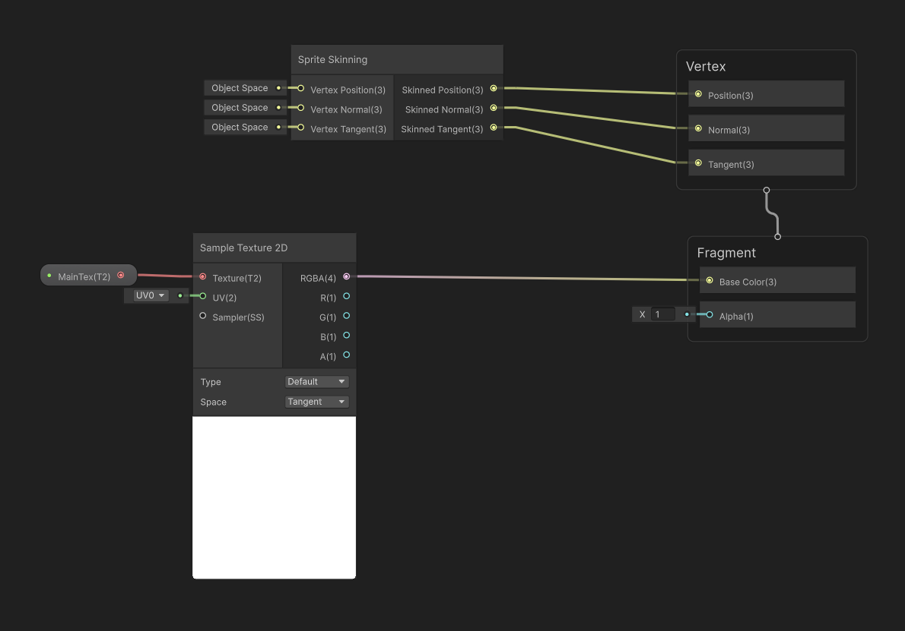

# Calculate sprite deformation on the GPU

Starting from 2D Animation 10 (Unity 2023.1), Sprite Skins can be deformed using two different methods, CPU and GPU deformation. However, do note that GPU deformation is only available with the [Universal Render Pipeline (URP)](https://docs.unity3d.com/Packages/com.unity.render-pipelines.universal@latest).

## Usage guidelines

The option to choose between CPU and GPU deformation allows projects to pick where the deformation should happen, on the CPU or the GPU. Projects which are heavily using the CPU for their different systems are therefore advised to use GPU deformation, and vice versa.

Do also note that selecting GPU deformation will cause the Sprite to be rendered using the [SRP Batcher](https://docs.unity3d.com/Manual/SRPBatcher.html). This means that there is a small draw call cost per object. When selecting CPU deformation, the Sprites are dynamically batched, reducing the overall draw calls. We therefore advice choosing CPU deformation when a scene contains many low-polygon objects, and GPU deformation when a scene contains fewer high-polygon objects.

As always, do verify the performance impact with [profiling tools](https://docs.unity3d.com/Manual/Profiler.html) and make changes according to the data, as every use case is unique.

## Requirements for GPU Deformation

- Use a shader that supports GPU Skinning. If you use shaders created with Shader Graph, ensure you include the [Sprite Skinning Node](https://docs.unity3d.com/Packages/com.unity.shadergraph@latest?subfolder=/manual/Sprite-Skinning-Node.html) in your shader graph.
  
- Avoid [Material Property Blocks](xref:UnityEngine.MaterialPropertyBlock), which are not compatible with the SRP Batcher.
- Avoid Sprite masks, which are not compatible with the SRP Batcher.  

> [!NOTE]
> If you don't meet any of these requirements, the rendering falls back to CPU Skinning which uses dynamic batching.

## Selecting CPU/GPU deformation

1. Ensure your project is setup with the [Universal Render Pipeline (URP)](https://docs.unity3d.com/Packages/com.unity.render-pipelines.universal@latest) package.
    * If the project isn't set up with the Universal Render Pipeline package, [refer to this guide](https://docs.unity3d.com/Packages/com.unity.render-pipelines.universal@latest?subfolder=/manual/Setup.html) on how to set it up.
2. Ensure that you enabled the **SRP Batcher** option in the [Universal Render Pipeline Asset](https://docs.unity3d.com/Packages/com.unity.render-pipelines.universal@latest?subfolder=/manual/universalrp-asset.html).
    * If the **SRP Batcher** option is not visible, open the **More** (⋮) menu in the Rendering section and enable **Show Additional Properties**.
3. Go to **Edit** &gt; **Project Settings** &gt; **Player** &gt; **Other Settings**. In the Rendering section, set **GPU Skinning** to **GPU (Batched)**. When **GPU Skinning** is set to **GPU (Batched)** or **GPU**, Unity performs Sprite Skin deformation on the GPU instead of the CPU.

## Speed up rendering with bone-based bounds calculations

If you enable GPU deformation, you can also set the **Bounds Mode** property of the Sprite Skin component to **Bone Based**. **Bone Based** speeds up Unity calculating the bounds of the sprite that determine whether to cull the sprite.

For more information, refer to [Sprite Skin component reference](SpriteSkin.md).
