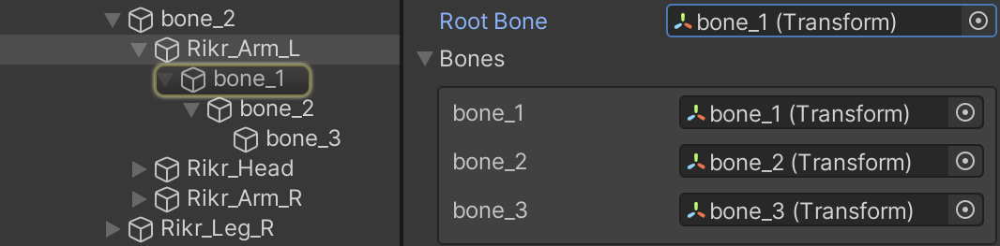

# Map bones to transforms automatically

When you enable **Auto Rebind**, Sprite Skin attempts to automatically locate the GameObject Transform that is needed for the current Sprite assigned to the Sprite Renderer. This is triggered when the Sprite in the Sprite Renderer property is changed.

When a rebind is required, the Sprite Skin looks for the GameObject Transform name that matches the bone name in the Skinning Editor module.

 Example: Selecting a Sprite in the [Bone Panel](SkinEdToolsShortcuts.md#bone-panel) shows the bones currently rigged to and influencing the Sprite, along with their names.

In the above example, the Sprite is rigged with three connected bones - starting with 'bone_1' as the root bone, 'bone_2' as a child of 'bone_1', and 'bone_3' as a child of 'bone_2'.

For the Sprite Skin component to automatically locate the bones successfully, GameObject Transforms with the same name and hierarchy as shown in the above example must be available in the Scene.

By setting the Sprite Skin’s **Root Bone** property to the correct GameObject Transform, Sprite Skin will then map the GameObject Transform to the Sprite’s rigged bone of the same name. For the **Auto Rebind** to be successful, the name and the hierarchy of the rigged bones and the GameObject Transforms must match. This means that changing the name of the bones in the Skinning Editor will require you to update the names of the GameObject Transforms to match as well.
