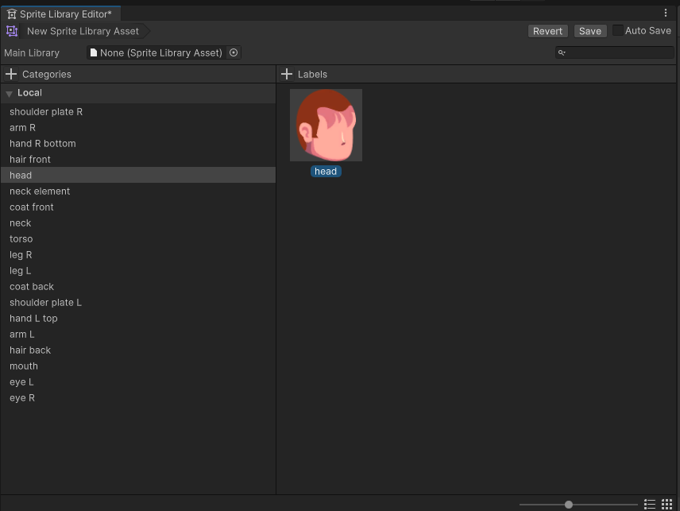
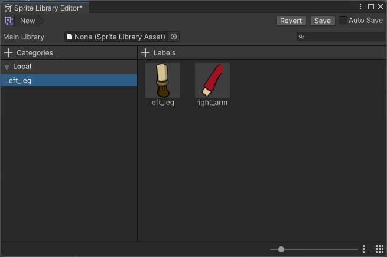

# Drag sprites to create or edit Categories and Labels

This page shows the different ways you can create or edit Categories and Labels in a Sprite Library Asset by dragging sprites directly into the Sprite Library Editor window.

You can automatically create new Categories and Labels by dragging sprites or [PSD Importer supported file types](https://docs.unity3d.com/Packages/com.unity.2d.psdimporter@latest) directly into the [Sprite Library Editor](SL-Editor.md) window.

## Prerequisites

- [PSD Importer package](https://docs.unity3d.com/Packages/com.unity.2d.psdimporter@latest) is required for the Sprite Library Editor to recognize imported .psb files.

## Create a new Category

1. In the open Sprite Library Editor window, drag a sprite directly onto the Categories column to create a new Category. You can't create Labels without selecting an existing Category first.

## Create a new Label for each sprite

1. Select a Category, then drag a or a selection of sprites into an empty space in the Labels column.

    _Dragging the `head` sprite into the Labels column creates a new Label named `head` in the selected Category._

2. Unity creates a new Label for each sprite in the selection and gives it the same name as the sprite it references. **Note:**  If an existing Label with the same name already exists at the destination, then the editor appends `_X` to the new Label's name, where `X` is the next number in sequence, starting from zero. For example, dragging in a selection of sprites all named `head` results in additional Labels created with the `_X` suffix for each sprite.

## Replace a Label's sprite reference

1. Drag a sprite onto an existing Label.

2. The editor replaces the sprite reference to the new sprite. The Label's name remains unchanged.

## Create a single Category with multiple Labels

1. Select multiple sprites from the Project window.

2. Drag the selected sprites into the Categories column to create a new Category. The Category is automatically named after the first sprite in the selection.

   

**Note:**  If an existing Category with the same name already exists at the destination, then the editor appends `_X` to the new Category's name, where `X` is the next number in sequence, starting from zero.

## Create Categories for each Layer and Layer Group

After you [prepare the .psb](PreparingArtwork.md) of your character, import it into Unity with the PSD Importer package. **Note:** The following [requires](#prerequisites) the PSD Importer package to be installed.

1. Enable **Use Layer Group** in the imported .psb's properties.

2. Drag the imported .psb file into the Sprite Library Editor's Categories column.

3. The editor creates a Category for each Layer and Layer Group, and creates Labels for each sprite. Sprites which belonged to the same Layer Group are automatically grouped into the same Category.

## Replace each Labels' sprite references

The following steps how to replace each Label's sprite reference with sprites from a different imported .psb. **Note:** This method only works if the imported .psb has Layers and Layer Groups with the same exact names as the original .psb used to [create the Categories and Labels](#create-categories-for-each-layer-and-layer-group).

This method is useful when you have multiple characters with the same Layers and Layer Groups and want to replace their respective sprites without creating a new Sprite Library Asset.

1. Enable **Use Layer Groups** in the replacement .psb file's properties.

2. Drag the replacement .psb onto an empty space in the Categories column and release. All sprite references of the same name and in the same Categories are automatically replaced with their respective counterparts from the replacement .psb.

## Additional resources
- [PSD Importer package](https://docs.unity3d.com/Packages/com.unity.2d.psdimporter@latest)
- [Preparing and importing artwork](PreparingArtwork.md)