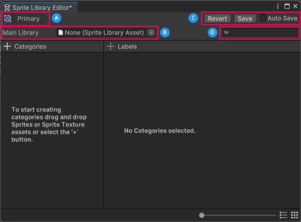
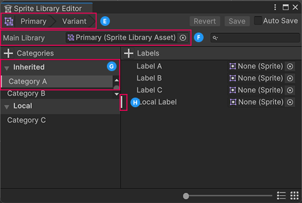

# Sprite Library Editor reference

The **Sprite Library Editor** window displays the content of the selected [Sprite Library Asset](SL-Asset.md). Use the editor to view, create, or edit the [Categories](SL-Editor.md#categories) and the [Labels](SL-Editor.md#labels) in the selected Sprite Library Asset.

A: The name of the Sprite Library Asset opened in this editor.
B: This displays this asset's [Main Library](SL-Main-Library.md) if it's a [Variant asset](SL-Asset.md#convert-a-sprite-library-asset-into-a-variant). Refer to [Variant asset-specific properties ](#variant-asset-specific-properties) for more information.
C: The [saving options](#saving-options) for changes made in this editor.
D: Enter a text string here to filter the Categories or Labels by name. Select the magnifying glass icon to the left of the filter to bring up its [context menu](#filter-context-menu).

## Saving options

Property  | Description
--|--
**Revert** | Select this to discard all unsaved changes and to return to the last saved state of the asset.
**Save** | Select this to keep all unsaved changes and include them in the saved state of the asset.
**Auto Save** | Enable this option to have the editor automatically save when you make any changes to the asset.

## Main Library

Property | Description |
-----|------|
**Main Library**| Assign a Sprite Library Asset to this to set it as the opened Sprite Library Asset's Main Library, and it will inherit the Main Library's Categories and Labels. Doing so also converts the opened Sprite Library Asset into a [Sprite Library Asset Variant](SL-Asset.md#convert-a-sprite-library-asset-into-a-variant).

## Filter context menu

Property | Description
--|--
**Category and Label** | Search for the entered search string in both Category and Label names.
**Category** | Search for the entered search string in only Category names.
**Label** | Search for the entered search string in only Label names.

## Categories and Labels columns

| Property | Description |
|-|-|
| **Categories** | Displays all [Categories](SL-Editor.md#categories) the opened Sprite Library Asset contains. The options are: <ul><li>**Local** foldout group: Groups all Categories created in this Sprite Library Asset.</li><li>**Inherited** foldout group: Groups all Categories inherited from this Sprite Library Asset Variant's Main Library. **Note:** This is only available if the opened Sprite Library Asset is a [Variant asset](SL-Asset.md#convert-a-sprite-library-asset-into-a-variant).</li></ul> Select **Add (+)** at the top left of this column to add a new empty **Category** to this asset. |
| **Labels** | Displays all [Labels](SL-Editor.md#labels) a selected **Category** contains, when you select one from the Categories column. Select **Add (+)** at the top left of this column to add a new empty **Label** to this asset. |
| **(Sprite)** object field | Displays the sprite that this Label refers to. This is blank by default. Select a sprite by opening the object picker, or drag a sprite directly onto this field. |

### Variant asset-specific properties
The following properties and UI features are visible only when you open a [Sprite Library Variant Asset](SL-Asset.md#convert-a-sprite-library-asset-into-a-variant) in the Sprite Library Editor.

E: The breadcrumb trail showing the names of the opened Variant asset and Library assets it inherits from.
F: The Main Library the Variant asset inherits from.
G: The Inherited group type that displays all Categories inherited from the Main Library.
H: A vertical white line which shows that an [override](SL-Main-Library.md#create-overrides) is present.

## Label context menu

Right-click over a Label in the Labels column to open this context menu.

| Property | Description |
|-|-|
| **Create a new Label** | Create a new local Label in the selected Category. |
| **Rename Label** | Rename the selected Label. This is unavailable if it's an inherited Label. |
| **Delete Selected Labels** | Deletes all selected Labels. This is unavailable if they're inherited Labels. |
| **Revert Selected Overrides** | Removes all overrides made in the selected Labels, and returns them back to their inherited state. |
| **Revert All Overrides**| Removes all overrides in the selected Category. |
| **Show Label Location** | This is only available if the selected Label has a set sprite reference. Select this to open the sprite that the Label references. |

## Additional resources
- [Sprite Library Editor fundamentals](SL-Editor.md)
- [Setting up for Sprite Swap](SpriteSwapSetup.md)