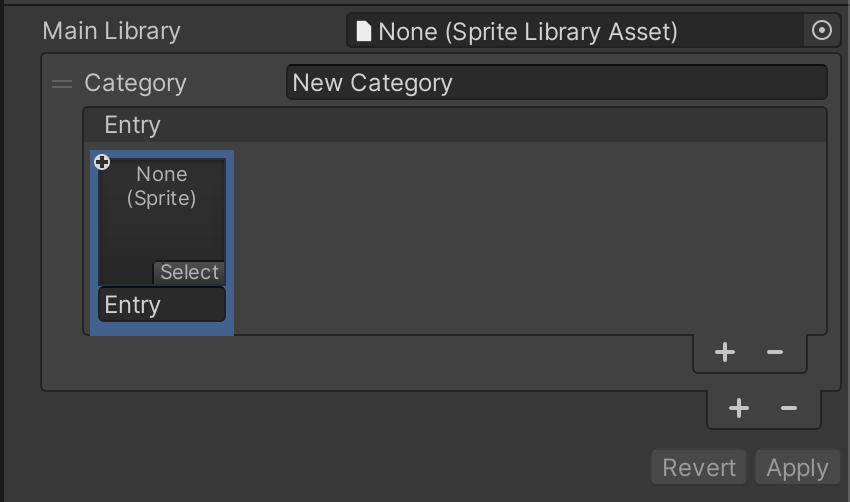
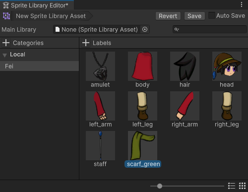
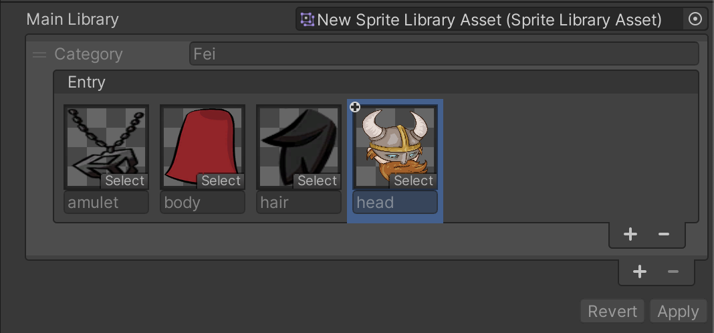
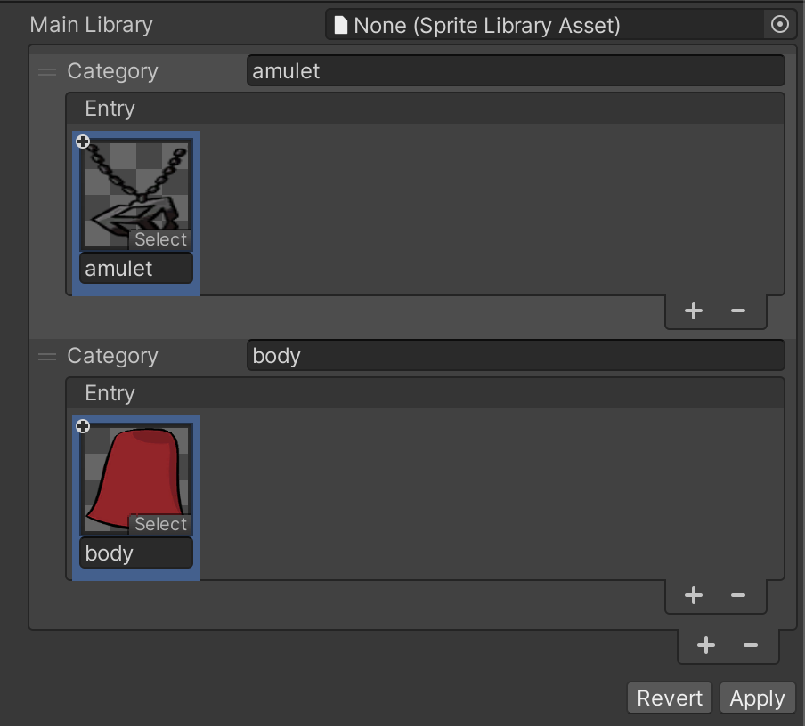

## Sprite Library Asset

A Sprite Library Asset is an Asset that helps group Sprites into categories. Combined with the Sprite Library component and Sprite Resolver component, it is used to achieve several outcomes for swapping Sprite visuals in runtime.

To create a __Sprite Library Asset__, go to __Assets__ > __Create__ > **2D** > __Sprite Library Asset__.

Once the Asset is created, click on the Asset to bring up the inspector window of the Sprite Library Asset.

To add a new Category, click on the ‘+’ button and it will create a new Category for the Sprite Library Asset

Users can rename the default Category name in the Category property text field.

To add new entries into the Category, click on the Category’s ‘+’ button and this will create a new entry inside the category.

With the new entry, users can also rename the entry and assign a Sprite to the entry.

Once the user is done with editing the Sprite Library Asset, the user can choose to click ‘Revert’ to remove unsaved changes or ‘Apply’ to save the changes.

The **Main Library** property allows the user to assign a Sprite Library Asset to the current one. This allows users to create a variant of the original Sprite Library Asset. By doing so, categories and entries in the Sprite Library Asset specified in the **Main Library** property, will be accessible in the current asset.

 Sprite Library Asset showing categories and entries that are retrieved from the Main Library property.

The names of the categories and entries retrieved from the Main Library property cannot be changed. These categories and entries cannot be removed as well. 

Users are allowed to add new entries into a category that is retrieved from the Main Library property. 

Users are also allowed to change the Sprite an entry is referring to. To remove the change, click on the inner ‘-’ button and it will restore back to the one that is retrieved from the Main Library property.

 Sprite Library Asset showing the Sprite of an entry has been modified.

There will be a ‘+’ icon indicator on the Sprite when 

1. The entry is added from the Sprite Library Asset

2. The entry is retrieved from the Main Library property and the Sprite the entry is referring to has been changed.

When assigning a Sprite Library Asset to the Main Library property, if the same category name already exists in current Sprite Library Asset, the entries from both categories will be merged into one category. 

Similarly, any entries in the same category that have the same name, will be merged and the entry will use the Sprite that was referred to in the current Sprite Library Asset.

When a Sprite Library Asset is removed from the Main Library property, changes that are made on the current Sprite Library Asset will remain.

### Drag and Drop

You can quickly populate categories and entries by drag and dropping Sprites into the Sprite Library Asset’s inspector

Dragging Sprites and Texture into empty space of the Inspector list will automatically create a new category and entry. The Sprite’s name will be used as the default name for the category and entry created.

If a Category name matches the name of the Sprite, the Sprite will be added into the category instead

You can also quickly populate a category by dragging and dropping Sprites into the category itself.

## Sprite Library component

The Sprite Library component is used to define which Sprite Library Asset to use at runtime. Attach this component to a GameObject or any parent GameObject of a Sprite Resolver component to allow the [Sprite Resolver](#sprite-resolver) to change the Sprite that is being used by a [Sprite Renderer](https://docs.unity3d.com/Manual/class-SpriteRenderer). 

In the Sprite Library component’s inspector, you can assign the desired Sprite Library Asset to use.

By assigning a Sprite Library Asset, the component’s Inspector will show a preview of the content in the Sprite Library Asset

Similar to the Sprite Library Asset’s inspector, the Sprite Library component's inspector also allows users to add new categories, change the Sprite an entry is referring to and add a new Sprite entry into the category.

## Sprite Resolver

The Sprite Resolver component is attached to each GameObject in the Prefab. The component pulls information from the [Sprite Library Asset](SLAsset.md) (assigned to the [Sprite Library component](SLComponent.md) at the root of the Prefab). The component contains two properties - [Category and Label](SpriteVis.html#sprite-tab) - and a visual Variant Selector that displays thumbnails of the Sprites contained in the Sprite Library Asset. 

 Inspector view of Sprite Resolver component.

| Property     | Function                                                     |
| ------------ | ------------------------------------------------------------ |
| __Category__ | Select which Category you want to use a Sprite from for this GameObject. |
| __Label__    | Select the Label of the Sprite you want to use for this GameObject. |

Select the Sprite you want the **Sprite Renderer** to render by selecting from the **Category** and **Label** dropdown menus, or select the Sprite directly in the visual Variant Selector.

### Sprite Resolver animation keyframe changes in Animation 6.0

The Sprite Resolver has been changed so that when it is being keyframe in Animation Window, only 1 property change will be recorded as compared to 2 previously.

 The previous Sprite Resolver key.

 The Sprite Resolver key from Animation 6.0 onwards.

## Sprite Skin component

The Sprite Skin component is responsible for deforming the Sprite that is assigned to a Sprite Renderer that is on the same GameObject as the Sprite Skin component.

The Sprite Skin deforms a Sprite by using GameObject Transforms to represent the bones that are setup in the Sprite from the Skinning Module.

| Property                        | Function                                                     |
| ------------------------------- | ------------------------------------------------------------ |
| **Always Update**               | When this is enabled, the Sprite Skin will continue to deform the Sprite even when the visual is not in the view of the Camera. |
| **[Auto Rebind](#auto-rebind)** | When this is enabled, the Sprite Skin will attempt to find the correct GameObject Transforms to use as bones for the Sprite by using the GameObject Transform set in the **Root Bone** property as the starting point. |
| **Root Bone**                   | The property is use to indicate which GameObject Transform will be use as the Root Bone for the Sprite |
| **Bones**                       | This shows the list of bones that are being setup for the Sprite in the Skinning Module. For each Sprite’s bone entry, there needs to be a GameObject Transform associated with it so that deformation can be done correctly. |
| **Create Bones**                | The button allows users to create GameObject Transform(s) to represent the Sprite’s Bone and assign them to the **Root Bone** property and the individual **Bones** entry. The **Root Bone** that will be created will be placed as a child of the GameObject of the Sprite Skin. The button will only be enabled if the **Root Bone** property is not assigned. |
| **Reset Bind Pose**             | The button resets the GameObject Transforms assigned in the Bones entry to the bind pose value setup for the Sprite in the Skinning Module. |
| **Enable Batching**             | When this is enabled, the deformation for the Sprite by Sprite Skin will be done in batch for optimization purposes. This option is only available when the Burst package and Collection package is installed. If either of them is not installed, the checkbox will be disabled and following information will be shown in the inspector.  |

### Auto Rebind

Enable **Auto Rebind** to have the Sprite Skin component attempt to locate the GameObject Transform that is needed for the current Sprite assigned to the Sprite Renderer. This is triggered when the Sprite in the Sprite Renderer property is changed. 

When a rebind is required, the Sprite Skin will look for the GameObject Transform name that matches the bone name in the Skinning Module.

In the above example, the Sprite is rigged with 3 bones; starting with *bone_1* as the root bone, *bone_2* as a child of *bone_1* and *bone_3* as a child of *bone_2*.

For Sprite Skin to successfully locate the bones, the following GameObjects with the same name and hierarchy will be required.

By setting the Sprite Skin’s **Root Bone** property to the correct GameObject Transform, Sprite Skin will then map the GameObject Transform to the Sprite’s bone.

This method has a limitation where the name and hierarchy path will have to match. Which means changing the name bone in the Skinning Module will require the user to change the GameObject’s name as well.