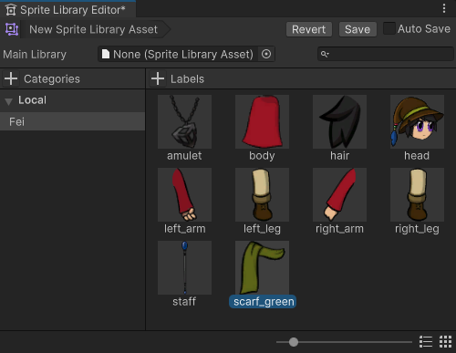
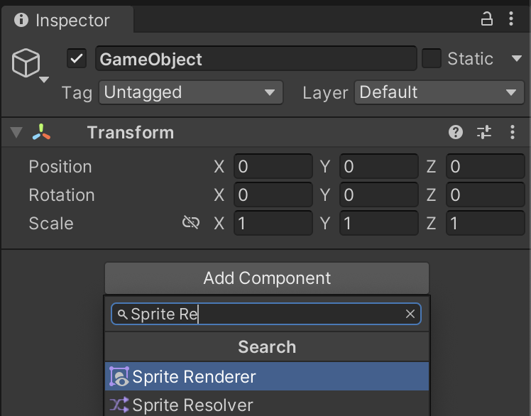
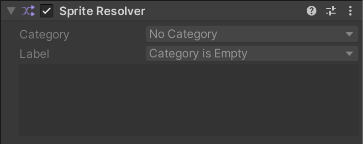

# Setting up for Sprite Swap
The following steps 
Follow the steps below to create a [Sprite Library Asset](SL-Asset.md), and choose which GameObjects refer to the Asset:

1. Select the Sprite Library Asset from the Asset creation menu by going to **Asset > Create > 2D > Sprite Library Asset** 

2. Select the new Sprite Library Asset and open it in the Sprite Library Editor. The editor displays the list of [Categories](SL-Asset.md#Categories) and [Labels](SL-Asset.md#Labels) available in the Asset.

3. Select **+** at the lower right of the List to add a new Category. Enter a name into **Category** (the default name is 'New Category'). Each Category in the same Sprite Library Asset must have a unique name. 

4. Add new Labels into the Category by either selecting **+** and then selecting a Sprite from the Object Picker window; or by [dragging](SL-Asset.md#drag-and-drop) a Sprite, Texture or [PSD Importer supported file type](#PreparingArtwork.md) onto an empty space within the Categories tab  

5. Create an empty GameObject (menu: Right-click on the **Hierarchy window > Create Empty**). Select it and then add the Sprite Renderer component. 

6. Add the [Sprite Library](SL-component.md) component to the same GameObject. Assign the Sprite Library Asset created in step 3 to **Sprite Library Asset**. 

7. Add the [Sprite Resolver](SL-Resolver.md) component to the same GameObject. 

8. Open the **Category** drop-down menu, and select a Category you created in step 3. The **Label** drop-down menu will become available and display thumbnails of the Sprites contained in the Category. 

9. Select a Sprite in the Sprite Resolver component to replace the current Sprite rendered by the Sprite Renderer component with the one you have selected.

It's also possible to use the [Sprite Resolver overlay](CharacterParts.md#sprite-resolver-scene-view-overlay) to swap Sprites directly from the Scene View.