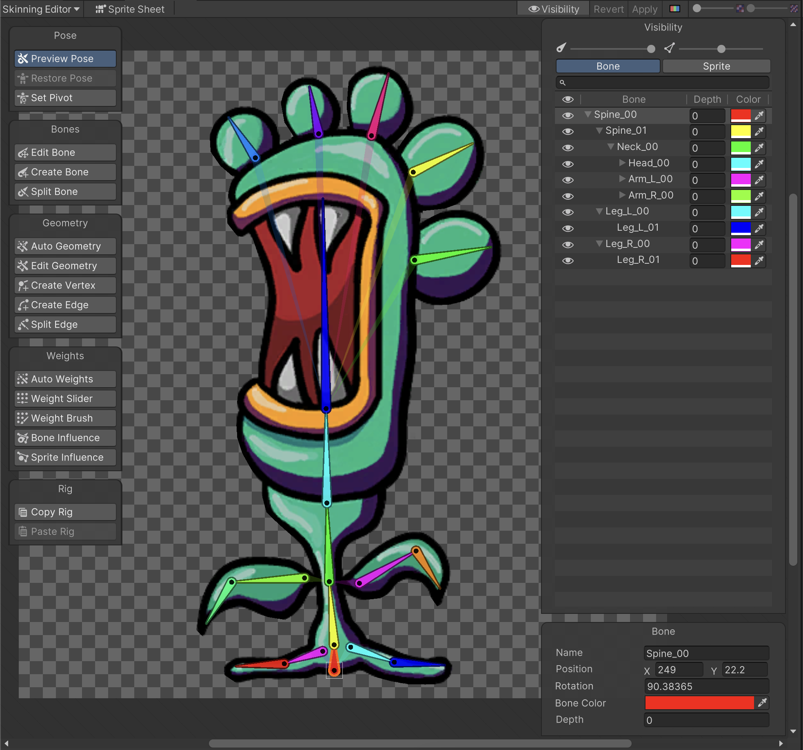
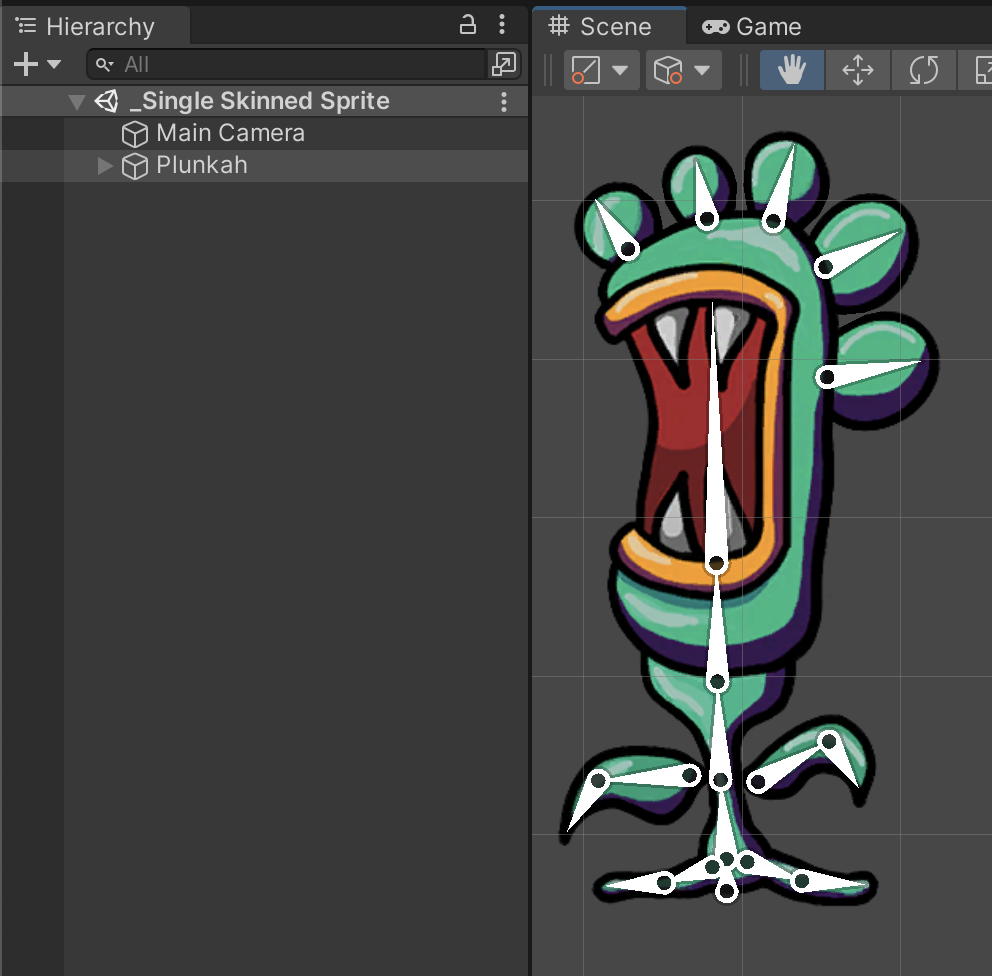

# Single Sprite rig with bone branching
This sample project is a slightly more complex example of a single Sprite rig similar to the [Simple](ex-simple.md)  project, but with bone branching instead of a single branch rig. The Sprite was imported with the [PSD Importer](https://docs.unity3d.com/Packages/com.unity.2d.psdimporter@latest) package.

The project and assets are in the `Assets/Samples/2D Animation/[X.Y.Z]/Samples/2 Single Skinned Sprite/` in the **Project** window.

Open the Asset `Assets/Samples/2D Animation/[X.Y.Z]/Samples/2 Single Skinned Sprite/Sprites/Plunkah.psd` in the [Skinning Editor](SkinningEditor.md) module to examine how the Sprite is rigged.

The `_Single Skinned Sprite` sample Scene show how the Asset is used in a Scene when it is animated with animation that [deforms](SpriteSkin.md) its Sprite mesh.

Follow the steps below to reconstruct the `_Single Skinned Sprite` sample Scene:

1. Create a new Scene, and drag the 'Plunkah' psd file into the scene.

2. Add the [Animator component](https://docs.unity3d.com/Manual/class-Animator.html) to the 'Plunkah' GameObject. Locate the Plunkah [Animator Controller Asset](https://docs.unity3d.com/Manual/Animator.html) in `Assets/Samples/2D Animation/[X.Y.Z]/Samples/2 Single Skinned Sprite/Animation/Plunkah.controller` and assign this Asset to the Animator’s **Controller** property.