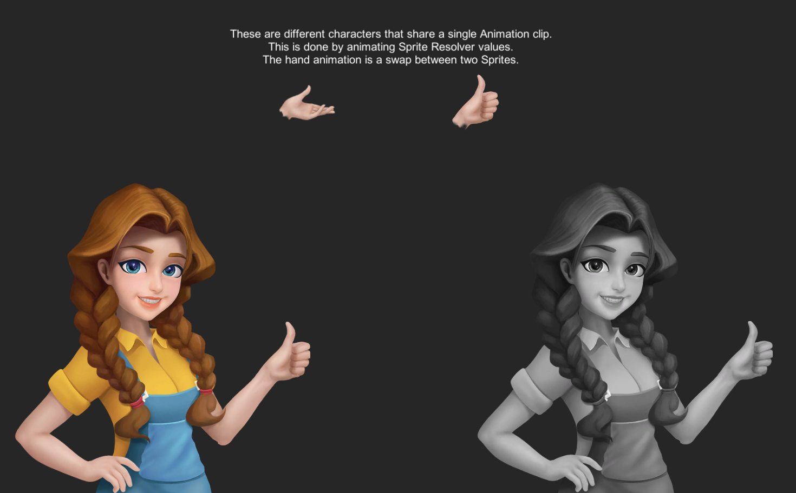
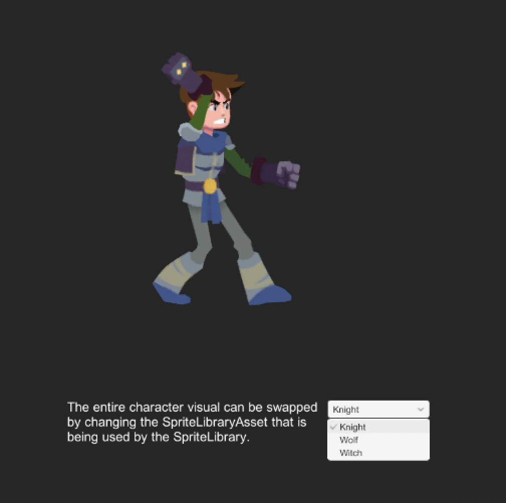
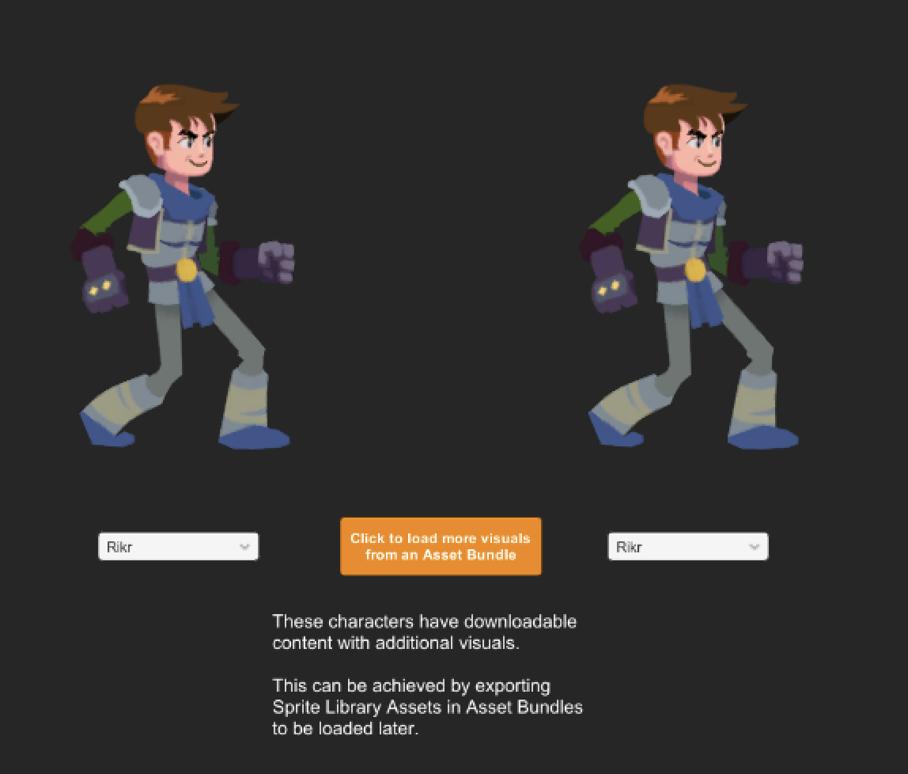

# Sprite Swap examples
This following sample projects demonstrate the different ways you can use Sprite Swap to achieve different effects and outcomes.

The Scenes for the following samples can be all found in `Assets/Samples/2D Animation/[X.Y.Z]/Samples/4 SpriteSwap`:

- [Animated swap](#animated-swap)
- [Part swap](#part-swap)
- [Full skin swap](#full-skin-swap)
- [DLC swap](#dlc-swap)
- [Skeleton Sharing](ex-skeleton-sharing.md)
- [Runtime Swap](ex-runtime-swap.md)

## Animated Swap
This sample demonstrates how to use Sprite Swap to create a reusable Animation Clip for animations that include both Sprite swapping and [deformation](SpriteSkin.md) of the Sprites. **Note:** Install the [PSD Importer](https://docs.unity3d.com/Packages/com.unity.2d.psdimporter@latest) package to use this sample.

Open the Scene file `1 Animated Swap.unity` to see the sample in action.

<br/>Initial frame with the hands in thumbs-up position.

This sample uses two different source files located in `Assets/Samples/2D Animation/[X.Y.Z]/Samples/5 SpriteSwap/Sprites`. The Assets used are:

- `dialog.psb`
- `dialog gray.psb`

These Assets are imported with the PSD Importer with its **Character Rig** property enabled. Both Assets are rigged with the same skeleton, and each Asset has two different Sprites for the hands which are swapped during the animation.

They are located in `Assets/Samples/2D Animation/[X.Y.Z]/Samples/5 Sprite Swap/Sprite Library` and are:

- `dialog.spriteLib` for the color character.
- `dialog gray.spriteLib` for the grayscale character.

Follow the steps below to reconstruct the sample Scene:

1. Drag both `dialog.psb` and `dialog gray.psb` Prefabs from the Project window into the Scene.

2. Add the [Sprite Library component](SL-component.md) to `dialog` GameObject, then assign the `dialog.spriteLib` Asset to its **Sprite Library Asset** property.

3. Add the [Sprite Library component](SL-component.md) to `dialog gray` GameObject, then assign the `dialog gray.spriteLib` Asset to its **Sprite Library Asset** property.

4. Expand the `dialog` GameObject's hierarchy and disable the `R_arm_2` child GameObject. This Asset is not required as it is swapped in during the animation.

5. Go to the `R_arm_1` GameObject, and add the [Sprite Resolver component](SL-Resolver.md). Select the `R_arm_2` graphic from the **Label** drop-down menu or from its thumbnail.

6. Repeat steps 4 to 5 with the `dialog gray` GameObject.

7. Add the [Animator component](https://docs.unity3d.com/Manual/class-Animator.html) to the `dialog` and `dialog gray` GameObjects. Locate the Dialog [Animator Controller Asset](https://docs.unity3d.com/Manual/Animator.html) in `Assets/Samples/2D Animation/[X.Y.Z]/Samples/5 Sprite Swap/Animation/Animators` and assign it to the Animator component's **Controller** property.

In this sample, the Sprite Library component is not attached to the same GameObject as the Sprite Resolver component. The Sprite Resolver attempts to locate a Sprite Library component starting from the same GameObject it is on and then traverse up the GameObject hierarchy. This lets a single or multiple Sprite Resolvers use the same Sprite Library component by attaching the Sprite Library component to a common root GameObject that the Sprite Resolver components are attached to.

## Part Swap
This sample demonstrates how to swap Sprite Assets using the API provided by changing the Sprite Resolver data. Open the `2 Part Swap.unity` Scene to see the sample in action.


In the Scene, each part has three different visual options that can be swapped. The graphic Assets are located in `Assets/Samples/2D Animation/[X.Y.Z]/Samples/5 SpriteSwap/Sprites`:

- `Knight.psb`
- `Skeleton.psb`
- `Witch.psb`

A [Sprite Library Asset](SL-Asset.md) containing Sprites made from all three graphic Assets above is created. A Category is created for each body part of the actor, with three Entries derived from the three different versions of the character. The Asset is located in `Assets/Samples/2D Animation/[X.Y.Z]/Samples/5 SpriteSwap/Sprite Library/Part Swap.spriteLib`.

Attach the Sprite Library component to the `KnightRig` GameObject in the Scene. Assign the `Part Swap.spriteLib` Asset to its **Sprite Library Asset** property.

Add the Sprite Resolver component to all Sprite Renderers under the `KnightRig` GameObject. Assign a Sprite that matches its corresponding GameObject, depending on the body part that GameObject represents. For example, select one of the Sprites in the 'Body' Category for the Sprite Resolver attached to the `KnightRig` GameObject and so on.

With this setup, you can swap any part of the actor to another Sprite individually.

### Swap part script
A custom MonoBehaviour script called `SwapPart` is attached to the `KnightRig` GameObject. This script is located in `Assets/Samples/2D Animation/[X.Y.Z]/Samples/5 SpriteSwap/Scripts/Runtime/SwapPart.cs`.

The script holds a reference to a Sprite Library component for retrieval of swappable Sprites. It also holds an array of data that describes the Category of Sprites in the Sprite Library that can be changed by a Sprite Resolver component.

When the Swap Part script starts up, it attempts to fetch the Sprite Library Asset that is used by a Sprite Library component.

```c++
var libraryAsset = spriteLibrary.spriteLibraryAsset;
```
From this Sprite Library Asset, it then fetches the Entries and Label names that are in a Category.

```c++
var labels = libraryAsset.GetCategoryLabelNames(swapOption.category);
```
This is then used to populate the UI Drop Down list.

When a value changes in the UI Drop Down List, it then sets the Sprite Resolver component to use the relevant Sprite.

```c++
swapOption.spriteResolver.SetCategoryAndLabel(swapOption.category, swapOption.dropdown.options[x].text);
```

## Full Skin Swap
This sample demonstrates how to swap Sprite visuals using the provided API by changing the [Sprite Library Asset](SL-Asset.md) referenced by the Sprite Library component. Open the `3 Full Swap.unity` Scene to see the sample in action.



In the Scene, there are three different visual Asset options that you can swap to. The Assets are located in `Assets/Samples/2D Animation/[X.Y.Z]/Samples/5 SpriteSwap/Sprites`:

- `Knight.psb`
- `Wolf.psb`
- `Witch.psb`

The Sprite Library Assets have identical Categories, Entries, and Label names but with different Sprites selected. The Assets are located in `Assets/Samples/2D Animation/[X.Y.Z]/Samples/5 SpriteSwap/Sprite Library`.

- `Knight.spriteLib`
- `Wolf.spriteLib`
- `Witch.spriteLib`

Attach the Sprite Library component to the `KnightRig` GameObject. Assign the `Knight.spriteLib` Asset to its Sprite Library Asset property.

Add the Sprite Resolver component to each of the Sprite Renderers under the `KnightRig` GameObject. Assign a Sprite to each Sprite Resolver that corresponds to the body part they are attached to. For example, the `torso` Sprite is selected for the Sprite Resolver attached to the `torso` GameObject.

### Swap Full Skin Script
A custom MonoBehaviour script called `SwapFullSkin` is attached to the` KnightRig` GameObject. This script is located in `Assets/Samples/2D Animation/[X.Y.Z]/Samples/5 SpriteSwap/Scripts/Runtime/SwapFullSkin.cs`

Where a value changes in the UI Drop Down List, the component sets the relevant Sprite Library Asset to be used for the Sprite Library component.

```c++
spriteLibraryTarget.spriteLibraryAsset = spriteLibraries[value];
```

## DLC Swap
This sample demonstrates how to swap Sprite visuals by changing the referenced Sprite Library Asset referenced by the Sprite Library component, using the API provided. This sample builds on the [Full Skin Swap](#full-skin-swap) sample.

This difference from the Full Skin Swap method is that the Sprite Library Asset is loaded from an [AssetBundle](https://docs.unity3d.com/Manual/AssetBundlesIntro.html) during runtime and added to the Sprite Library component at a later time. Open the  `4 DLC Swap.unity` Scene to see the sample in action.



To ensure the AssetBundle works correctly, check that the `Skeleton.spriteLib` Asset in `Assets/Samples/2D Animation/[X.Y.Z]/Samples/5 SpriteSwap/Sprite Library` is labeled with its corresponding AssetBundle tag.

### Load Swap DLC Script
A custom MonoBehaviour script called `LoadSwapDLC` is attached to the `Load DLC` GameObject. The script is located in `Assets/Samples/2D Animation/[X.Y.Z]/Samples/5 SpriteSwap/Scripts/Runtime/LoadSwapDLC.cs`

The script starts up when the DLC is loaded, it scan the AssetBundles for any Sprite Library Assets. Once the Sprite Library Assets are loaded, it adds these Entries into the `SwapFullSkin` script from the [Full Skin Swap](#full-skin-swap) sample.